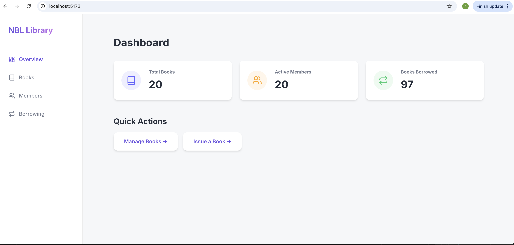

# NBL (Neighbourhood Book Library)

A web application for sharing and borrowing books within a neighbourhood.




## Prerequisites

- [Docker](https://www.docker.com/) (for Docker Compose method)
- [Python 3.10+](https://www.python.org/)
- [Node.js 18+](https://nodejs.org/)
- [PostgreSQL](https://www.postgresql.org/) (for manual setup)

## Method 1: Quick Start (Docker Compose)

The easiest way to run the entire stack (Database, Backend, Frontend) is using Docker Compose.

1.  Make sure Docker is running.
2.  Run the following command in the project root:

    ```bash
    docker-compose up --build
    ```

3.  Access the application:
    - Frontend: `http://localhost:5173`
    - Backend API Docs: `http://localhost:8000/docs`

4.  **Populate Sample Data** (Optional):
    In a new terminal, run from the project root:
    ```bash
    ./populate_data.sh
    ```
